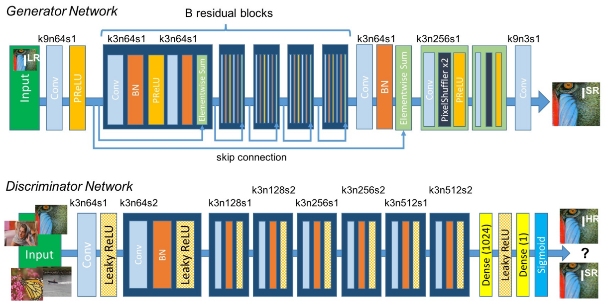
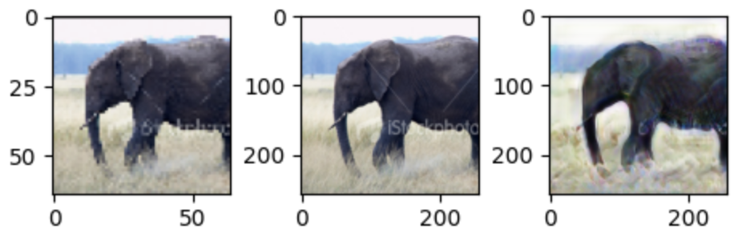

# Pytorch-SRGAN

## Table of contents
- [Pytorch-SRGAN](#Pytorch-SRGAN)
  - [Overview](#Overview)
  - [Requirements](#Quickstart)
  - [Implementation](#Implementation-Details)
  - [Results](#Results)
  - [Contributors](#Contributors)

## Overview
This repository re-implements [SRGAN](https://arxiv.org/abs/1609.04802v5) in a modular setting that allows for easier experimentation. SRGAN is a conditional GAN that is capable of doing super resolution of input images. The generator is fully convolutional, allowing it to work with any image size. We trained on numerous datasets and experimented with various architectures for the generator and discriminator, as well as different loss functions. 
The details of these experiments can be found in the writeup under docs. 

<p align="center">
    
</p>

## Quickstart
Use the following command to install required packages to a virtual environment of your choosing.
```
pip install -r /path/to/requirements.txt
```
The main.py file that is a useful starting point. We run this file from the root directory using `python -m main -m train` using Python 3.10.12. Argparse is used to override default behavior and yaml files stored in "configs" control the network architecture, dataset configuration, and some training settings. A copy of this configuration file is saved after each training session for reference.  

Alternatively, SRGAN-PyTorch is configured as a module if the user wishes to call functions in their own jupyter notebook.

## Implementation Details

### Dataset(s)
We trained on two datasets, [CIFAR10](https://www.cs.toronto.edu/~kriz/cifar.html) and [ImageNet](https://image-net.org/download.php). We used the CIFAR-10 images in their native resolution (32x32x3) and took 96x96x3 crops of the imagenet images during training.

### Preprocessing
Super-resolution uses a bicubic kernel to create low resolution (LR) images from the high resolution (HR) ground-truths. In our experiments, we preprocessed using bicubic interpolation operations. The default scaling factor is 4, but can be overriden by user input. The low resolution images were scaled between [0, 1] and the high resolution labels [-1, 1], following the SRGAN paper. 

### Training
We trained our GAN using a two step approach. In the first step, pretraining, we train the generator alone using MSE loss. The idea of this step is to produce a stable starting point before introducing stochasticity related to typical conditional GAN training. After completing pretraining, we train the generator and discriminator jointly. The generator can be configured to use either MSE or a feature based loss in conjunction with the typical adversarial term. The feature loss computes the MSE of feature maps sampled from [VGG, ResNet]. The discriminator can be trained using classic cross-entropy loss or a variant described in [lsgan](https://arxiv.org/pdf/1506.05751) that aims to provide stabler gradients. 

## Results
CIFAR10:
We found super-resolution difficult to work with on CIFAR10. We trained hundreds of models, but were never able to reduce the FID score below ~80. The MSE trained model achieved 85.04, whereas the Feature Based loss marginally improved to an FID score of 84.8. We hypothesize that the 8x8x3 low resolution images may not contain enough information to learn a general probability distribution. 

ImageNet:
We were able to achieve an FID score of ~40 on a 250k subsample of imagenet. At the time of writing, perceptual loss using VGG19 outperforms ResNet50. Samples from the testset are shared below. We are actively working on improving the sharpness of the images but compute remains a constraint. 

<p align="center">
    
    
</p>

## Active Contributors
Andrew Kettle

## Version 1 Contributors
Andrew Kettle (Lead), Feilong Hou, Steven Chang
